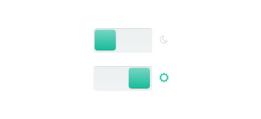

lightSwitch
===========

Hi! I'm a light switch designed with a little bit of CSS3 and jQuery. Use me, I'm nice, animated and f***ing light !



## How to use me?

### Installation

First, you need to add two good librairies in your HTML code : 
* [FontAwesome](http://fortawesome.github.io/Font-Awesome/icons/) for the moon and the sun (so easy to change!)
* [jQuery](http://jquery.com/)

### HTML

Create a **checkbox** with the `lightSwitch` class :

````html
<input type="checkbox" name="light" class="lightSwitch" />
````

### jQuery

Then call the lightSwitch function on this checkbox to create me :

````javascript
$('.lightSwitch').lightSwitch();
````

## Add a callback function

You can use me to call a function when I'm ON or OFF. To do this, add options brackets in the call of the lightSwith function :

````javascript
$('.lightSwitch').lightSwitch({
	on_callback: function_when_im_on,
	off_callback: function_when_im_off
});
````

## One more thing

You can watch this in the `example.html` file :stuck_out_tongue_winking_eye:
Have fun !

## License

This plugin is available under [the MIT license](http://opensource.org/licenses/mit-license.php);

## Thanks to...

* [Jonathan Martin](https://github.com/iw2) for his contribution

[Follow me on Twitter !](https://twitter.com/sebg)

